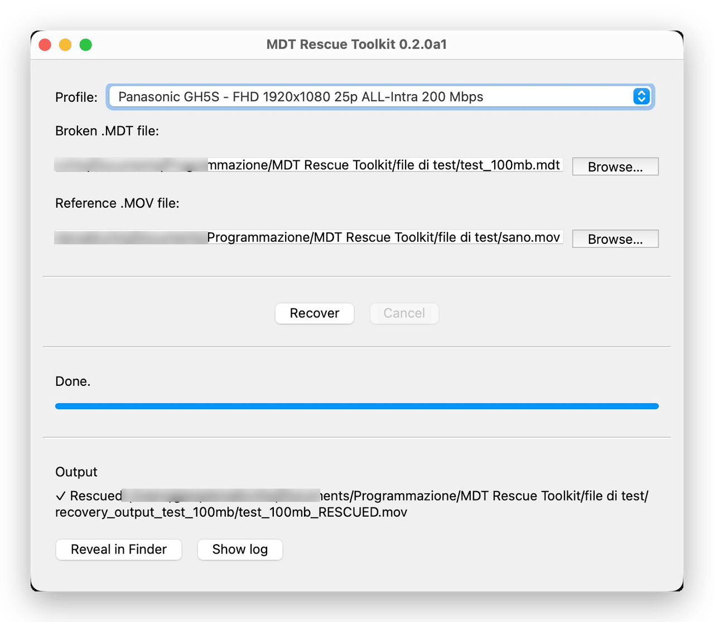

# MDT Rescue Toolkit

> A profile-based recovery toolkit for unfinalized `.MDT` video files.

**Version:** 0.2.0-alpha.1
**Status:** Alpha
**Supported profile:** Panasonic GH5S, FHD 1920×1080, 25 fps PAL, H.264 High 4:2:2 Intra, ALL-I 200M



---

## Born from a real recovery case

This toolkit was built to rescue a 33 GB `.MDT` file produced by a Panasonic DC-GH5S whose recording was interrupted by the well-known *"Battery Grip of Death"* event.

The file was abandoned by the camera in an unfinalized state: no `moov` atom, no SPS/PPS in headers, just raw AVC-Intra video and PCM audio chunks interleaved with timecodes. After hours of binary analysis and structured testing (100 MB → 1 GB → full file), the result was a complete recovered MOV: 23m 33s of pristine 4:2:2 10-bit video plus its original PCM audio, matching the validated recovery baseline used throughout this project.

This toolkit packages what we learned. It is **not a generic `.MDT` recovery tool** — it works only on the exact profile we validated. If your situation matches, it will probably help. If not, it provides a template for analysis.

---

## What this toolkit does

Given:
- A corrupted `.MDT` file from a Panasonic GH5S in FHD 25p ALL-I 200M
- A "sane" reference `.MOV` recorded in the same session with the same settings

The toolkit produces:
- A clean `.MOV` file with video + audio properly interleaved
- The same codec, color space, bit depth, and bitrate as the camera's native output
- An ffprobe-verifiable file that imports natively into DaVinci Resolve, Final Cut, and Premiere

---

## Supported profile (validated)

This release supports **only one validated profile**:

| Parameter | Value |
|---|---|
| Camera model | Panasonic DC-GH5S |
| Container | `.MDT` (unfinalized MOV variant) |
| Video codec | H.264 High 4:2:2 Intra (AVC-Intra) |
| Profile | ALL-Intra 200 Mbps |
| Resolution | 1920 × 1080 |
| Frame rate | 25 fps PAL |
| Chroma | 4:2:2 |
| Bit depth | 10-bit |
| Audio codec | PCM s16 big-endian (`twos`) |
| Audio sample rate | 48000 Hz |
| Audio channels | 2 (stereo) |

**If your file does not match this profile, the toolkit will likely fail or produce garbage.** Future versions may add support for other profiles (FHD 50p, 4K, GH5 variants), but only based on validated test cases.

---

## Two ways to use it

As of v0.2, the same recovery pipeline is available through two entry points that produce **byte-identical output**:

1. **The v0.1 shell CLI** (`recover_gh5s_fhd25_alli.sh`) — the original, battle-tested orchestrator. Still fully supported.
2. **The v0.2 Python API** (`mdt_rescue.orchestrator.recover()`) — a testable, importable Python layer that composes the same extraction primitives. Suitable for integration into other tools or a future GUI.

For the validated profile, both paths run the same seven-stage pipeline (SPS/PPS extraction → video NAL extraction → prefix concatenation → MOV wrap → audio extraction → mux → verification) and are validated bit-exact against the same baseline.

---

## Requirements

- macOS or Linux (tested on macOS)
- Python 3.11+ (the Python API uses `StrEnum`)
- `ffmpeg` and `ffprobe` (8.0+ recommended)
- A "sane" reference `.MOV` from the same recording session (or another GH5S file with identical settings)
- Free disk space: **at least 3× the size of your corrupted `.MDT`** (working files + final output)

Install ffmpeg on macOS:
```bash
brew install ffmpeg
```

---

## Installation

```bash
git clone https://github.com/alicchiog/mdt-rescue-toolkit.git
cd mdt-rescue-toolkit
```

For the shell CLI, make the scripts executable:
```bash
chmod +x recover_gh5s_fhd25_alli.sh scripts/verify_output.sh
```

For the Python API, install the package (editable install recommended for development):
```bash
pip install -e .
```

The extraction scripts use only the Python standard library; `ffmpeg`/`ffprobe` are the only external runtime dependencies.

---

## Usage

### Shell CLI (v0.1)

```bash
./recover_gh5s_fhd25_alli.sh /path/to/broken.mdt /path/to/sane_reference.mov
```

The script will:
1. Check that `ffmpeg` and `ffprobe` are available
2. Verify both input files exist
3. Check available disk space
4. Create an output directory `recovery_output_<basename>/`
5. Run the full recovery pipeline (extraction + mux + verification)
6. Log every step to `recovery_log.txt`
7. Produce `<basename>_RESCUED.mov` as the final result

**The original `.MDT` file is never modified.** The toolkit only reads from it.

### Python API (v0.2)

```python
from mdt_rescue.orchestrator import recover
from mdt_rescue.profiles import GH5S_FHD25_ALLI_200M

result = recover(
    mdt_path="/path/to/broken.mdt",
    reference_mov_path="/path/to/sane_reference.mov",
    profile=GH5S_FHD25_ALLI_200M,
)

if result.success:
    print("Rescued:", result.rescued_mov_path)
```

`recover()` accepts optional `output_dir`, a `progress` callback (receives `ProgressEvent` objects per stage), and a `cancel_token` for cooperative cancellation. It returns a `RecoveryResult` with `success`, `cancelled`, `stages_completed`, the produced `artifacts` mapping, and `rescued_mov_path`.

### Example

```bash
./recover_gh5s_fhd25_alli.sh P1194247.mdt sane_reference.mov
```

After the run completes (duration depends heavily on file size and disk speed), you will get:

```
recovery_output_P1194247/
├── P1194247_sane_annexb.h264        # reference converted to Annex-B
├── P1194247_sps_pps_prefix.h264     # extracted SPS/PPS prefix
├── P1194247_video.h264              # extracted H.264 stream
├── P1194247_video_with_header.h264  # with SPS/PPS prepended
├── P1194247_video_only.mov          # video-only MOV
├── P1194247_audio.raw               # raw PCM s16be
├── P1194247_audio.wav               # WAV
├── P1194247_RESCUED.mov             # final muxed video+audio
└── recovery_log.txt                 # log of the run
```

---

## Testing

Run the standard test suite (fast, fully mocked, no external files):

```bash
pytest
```

The suite covers the engine primitives, the Profile definitions, and the orchestrator. The end-to-end smoke test is gated and skipped by default.

The smoke test exercises the real `recover()` pipeline on actual input files and verifies the output bit-exact against the captured v0.1 baseline. It is opt-in and requires both the input files and an explicit environment variable:

```bash
MDT_RUN_SMOKE=1 pytest -m slow tests/test_smoke_e2e.py -v
```

Without `MDT_RUN_SMOKE=1`, or if the input files are absent, the smoke test skips cleanly rather than failing.

---

## What if it doesn't work?

The toolkit may fail or produce a broken file if:

- Your file is not from a GH5S, or not in FHD 25p ALL-I 200M
- The sane reference doesn't match the broken file's encoding parameters
- The corruption is too severe (file truncated near the start, before any video frames)
- The audio interleaving pattern doesn't match the validated model

If this toolkit can't help your case, commercial recovery services and open-source tools such as [Untrunc](https://github.com/anthwlock/untrunc) may handle other situations. You can also inspect your `.MDT` with `xxd` and compare it to the validated pattern in `profiles/gh5s_fhd25_alli_200m.md`. If the structure differs significantly, this toolkit is not for you.

---

## Warning and disclaimer

This tool is **experimental**. It is not affiliated with Panasonic. It was built from a single real recovery case and currently supports only one validated profile. **Always work on copies** of your corrupted file. **No recovery is guaranteed.**

The authors and contributors of this toolkit accept no liability for any data loss, time loss, or other damages arising from its use. By using this software you agree that you do so at your own risk.

If your footage is irreplaceable and time-critical, consider a paid recovery service as a parallel option. This toolkit is a free alternative, not a replacement for professional recovery in high-stakes scenarios.

---

## Project structure

```
mdt-rescue-toolkit/
├── README.md                              # this file
├── LICENSE                                # MIT
├── CHANGELOG.md                           # version history
├── pyproject.toml                         # package metadata
├── .gitignore
├── recover_gh5s_fhd25_alli.sh             # v0.1 shell orchestrator
├── mdt_rescue/                            # v0.2 Python package
│   ├── __init__.py
│   ├── profiles.py                        # Profile dataclasses + GH5S_FHD25_ALLI_200M
│   ├── orchestrator.py                    # recover() public API
│   └── engine/                            # extraction primitives
│       ├── sps_pps.py                     # SPS/PPS extraction
│       ├── video.py                       # video NAL extraction
│       ├── audio.py                       # audio chunk extraction
│       └── verify.py                      # ffprobe-based verification
├── scripts/                               # v0.1 thin CLI wrappers
│   ├── extract_video_gh5s_fhd25_alli.py
│   ├── extract_audio_gh5s_fhd25_alli.py
│   ├── extract_sps_pps.py
│   └── verify_output.sh
├── profiles/
│   └── gh5s_fhd25_alli_200m.md            # detailed format description
├── docs/
│   ├── recovery_workflow.md               # step-by-step pipeline explanation
│   ├── troubleshooting.md                 # common failure modes
│   └── limitations.md                     # what this toolkit does NOT do
├── tests/                                 # pytest suite + baselines
└── examples/
    └── commands.md                        # example invocations
```

---

## Contributing

If you have a `.MDT` file that matches the supported profile and the toolkit fails on it, please open an issue with:
- Your camera model and firmware version
- The recording settings (resolution, framerate, codec)
- Output of `xxd -l 256 your_file.mdt | head -20`
- The exact error from `recovery_log.txt`

If you have a `.MDT` from a different profile and want to extend the toolkit, please open a discussion before submitting a PR. We want to keep the project conservative and well-tested.

---

## License

MIT. See `LICENSE`.

---

## Acknowledgments

This project was born from a real-world recovery need and from the belief that niche recovery knowledge should be documented, tested, and shared.
